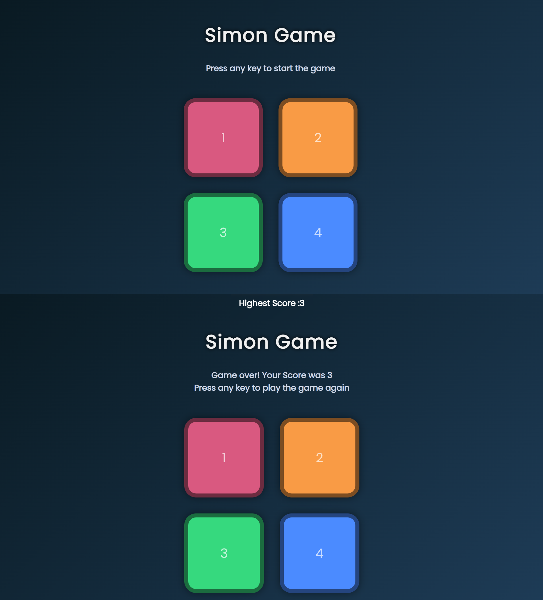

🎮 Simon Game – HTML • CSS • JavaScript

A fun and interactive Simon Says Game built using pure HTML, CSS, and JavaScript.
The game tests your memory as you repeat the growing sequence of flashing colors.
Includes scoring, highest score saving, animations, and a clean modern UI.

🚀 Features

✔ Pure HTML + CSS + JavaScript
✔ Random color sequence generator
✔ Flash animations for tiles
✔ User click detection
✔ Level progression
✔ Game over + restart system
✔ Highest score saved in localStorage
✔ Responsive layout
✔ Clean UI with custom colors

📸 Game Preview

The image below shows:

Game Start Screen

Game Over Screen

Both combined into one preview.

🎯 How the Game Works

Press any key → game starts

One random color flashes

You must click the same color

Each next level adds one more color to the sequence

If you make a mistake → Game Over

Highest Score updates automatically

🧠 Tech Stack
Technology Purpose
HTML5 Game structure
CSS3 Styling, colors, animations
JavaScript (ES6) Game logic & events
localStorage Save highest score

📁 Project Structure
📦 Simon-Game
├── index.html
├── style.css
├── app.js
├── assets/
│ └── simon_combined.png
└── README.md

🛠️ How to Run

# Clone the repo

git clone https://github.com/your-username/simon-game.git

# Go inside project folder

cd simon-game

# Run the game

Open index.html in your browser

✨ Future Improvements

Add button sounds

Add difficulty modes

Add light/dark themes

Add animations & glow effects

Add scoreboards

👨‍💻 Author

Chinmay G
Frontend developer exploring interactive JS-based games.

⭐ Support The Project

If you like this game:

⭐ Star the repo

🍴 Fork it

📝 Submit suggestions
